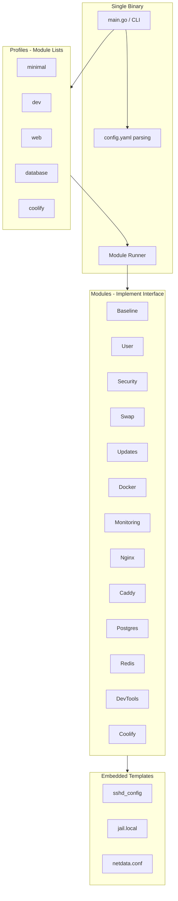

# Phanes VPS Provisioning System - Product Requirements Document

## Overview

Phanes is a pure Go-based VPS provisioning system that compiles to a single binary. It provides an idempotent, modular approach to server setup, allowing users to quickly configure servers with predefined profiles or custom module combinations. The system is designed to be "clone and run" - users download the binary, provide a configuration file, and execute a profile to set up their server.

## Problem Statement

Setting up a new VPS server involves many repetitive tasks:
- Basic system configuration (timezone, locale, users)
- Security hardening (firewall, SSH, fail2ban)
- Installing and configuring services (Docker, databases, web servers)
- Setting up development tools
- Configuring monitoring

Doing this manually is:
- Time-consuming and error-prone
- Not reproducible across servers
- Difficult to customize for different server types
- Hard to maintain consistency

Existing solutions (Ansible, Terraform, etc.) are powerful but:
- Require learning domain-specific languages
- Have complex dependency management
- May be overkill for simple server setups
- Don't provide a "clone and run" experience

## User Stories

### Primary Users
- **Developer**: Needs to quickly set up development servers with consistent tooling
- **DevOps Engineer**: Needs to provision production servers with security and monitoring
- **Hobbyist**: Wants to set up personal servers without deep Linux knowledge

### Core User Stories

1. **As a developer**, I want to run a single command to set up a development server so that I can start coding immediately
2. **As a DevOps engineer**, I want to provision servers with security hardening so that production servers are secure by default
3. **As a user**, I want to customize which components are installed so that I only install what I need
4. **As a user**, I want to run the tool multiple times safely so that I can update configurations without breaking things
5. **As a developer**, I want a single binary so that I can easily deploy and run the tool on any Linux server

## Technical Approach

### Architecture



### Core Design Principles

1. **Idempotency**: All modules check if they're already installed before running. Safe to run multiple times.
2. **Modularity**: Each component (Docker, PostgreSQL, etc.) is a separate module that can be composed.
3. **Single Binary**: Compiles to one executable - no dependencies, easy to deploy.
4. **Configuration-Driven**: YAML config file controls all settings.
5. **Profile-Based**: Predefined combinations of modules for common server types.
6. **Dry-Run Support**: Preview changes before executing.

### Project Structure

```
phanes/
├── main.go                     # Entry point, CLI setup
├── go.mod
├── config.yaml.example         # Example configuration
├── internal/
│   ├── config/
│   │   └── config.go           # Config struct + YAML loading
│   ├── runner/
│   │   └── runner.go           # Executes modules in order
│   ├── module/
│   │   ├── module.go           # Module interface definition
│   │   ├── baseline.go         # Timezone, locale, apt update
│   │   ├── user.go             # User creation, SSH keys
│   │   ├── security.go         # UFW, fail2ban, SSH hardening
│   │   ├── swap.go             # Swap file
│   │   ├── updates.go          # Unattended upgrades
│   │   ├── docker.go           # Docker CE + Compose
│   │   ├── monitoring.go       # Netdata
│   │   ├── nginx.go            # Nginx
│   │   ├── caddy.go            # Caddy
│   │   ├── postgres.go         # PostgreSQL
│   │   ├── redis.go            # Redis
│   │   ├── devtools.go         # Git, build-essential, etc.
│   │   └── coolify.go          # Coolify installation
│   ├── profile/
│   │   └── profile.go          # Profile definitions (module lists)
│   ├── exec/
│   │   └── exec.go             # Command execution helpers
│   └── log/
│       └── log.go              # Colored logging
└── templates/
    ├── templates.go            # go:embed directive
    ├── sshd_config.tmpl
    ├── jail.local.tmpl
    └── ...
```

### Module Interface

All modules implement a consistent interface:

```go
type Module interface {
    Name() string
    Description() string
    IsInstalled() (bool, error)
    Install(cfg *config.Config) error
}
```

This ensures:
- Consistent behavior across modules
- Easy to add new modules
- Idempotency checks built-in
- Clear separation of concerns

### Configuration Structure

Configuration is YAML-based with sensible defaults:

```yaml
# User settings
username: deploy
ssh_public_key: "ssh-ed25519 AAAA... user@host"
timezone: America/New_York

# Feature toggles
swap:
  enabled: true
  size: 2G

security:
  ssh_port: 22
  allow_password_auth: false
  
docker:
  install_compose: true

postgres:
  version: "16"
  password: "change-me-in-production"

redis:
  password: "change-me-in-production"
```

### Profiles

Predefined module combinations:

- **minimal**: baseline, user, security, swap, updates
- **dev**: baseline, user, security, swap, updates, docker, monitoring, devtools
- **web**: baseline, user, security, swap, updates, docker, monitoring, caddy
- **database**: baseline, user, security, swap, updates, docker, monitoring, postgres, redis
- **coolify**: baseline, user, security, swap, updates, docker, coolify

### CLI Usage

```bash
# Run a profile
./phanes --profile dev --config config.yaml

# Run specific modules
./phanes --modules baseline,user,docker --config config.yaml

# Dry run (show what would happen)
./phanes --profile dev --config config.yaml --dry-run

# List available modules and profiles
./phanes --list
```

## UX/UI Considerations

### Command-Line Interface

- **Clear Output**: Colored logging (info=cyan, success=green, error=red, skip=yellow)
- **Progress Indication**: Show which module is currently running
- **Error Messages**: Actionable error messages with suggestions
- **Dry-Run Mode**: Preview all changes before executing
- **Help Text**: Comprehensive help with examples

### User Experience Flow

1. User downloads/clones the repository
2. Copies `config.yaml.example` to `config.yaml`
3. Edits `config.yaml` with their settings
4. Runs `./phanes --profile <profile> --config config.yaml`
5. Tool executes modules in order, showing progress
6. Tool reports success/failure for each module
7. User can run again safely (idempotent)

### Error Handling

- Clear error messages indicating which module failed
- Suggestions for common issues
- Continue or stop based on error severity
- Exit codes: 0 = success, 1 = error

## Acceptance Criteria

### Functional Requirements

1. ✅ Tool compiles to a single binary
2. ✅ Tool can load and validate YAML configuration
3. ✅ Tool can execute predefined profiles
4. ✅ Tool can execute custom module combinations
5. ✅ All modules are idempotent (safe to run multiple times)
6. ✅ Dry-run mode shows actions without executing
7. ✅ Tool provides clear, colored output
8. ✅ Tool handles errors gracefully

### Module Requirements

1. ✅ Baseline module: Sets timezone, locale, updates apt
2. ✅ User module: Creates user, configures SSH keys, sudoers
3. ✅ Security module: Configures UFW, fail2ban, SSH hardening
4. ✅ Swap module: Creates and configures swap file
5. ✅ Updates module: Enables automatic security updates
6. ✅ Docker module: Installs Docker CE and Compose v2
7. ✅ Monitoring module: Installs and configures Netdata
8. ✅ Nginx module: Installs and starts Nginx
9. ✅ Caddy module: Installs Caddy with systemd service
10. ✅ PostgreSQL module: Installs PostgreSQL, creates database/user
11. ✅ Redis module: Installs and configures Redis
12. ✅ DevTools module: Installs Git, build tools, language runtimes
13. ✅ Coolify module: Installs Coolify with Docker Compose

### Quality Requirements

1. ✅ Code follows Go best practices
2. ✅ All public functions/types have godoc comments
3. ✅ Unit tests for core functionality
4. ✅ Error handling throughout (no panics)
5. ✅ Configuration validation with clear error messages

## Dependencies

### External Dependencies

- **Go 1.21+**: Programming language
- **gopkg.in/yaml.v3**: YAML parsing
- **Standard Library**: All other functionality uses Go stdlib

### System Dependencies (on target server)

- **Ubuntu 22.04+**: Target operating system
- **sudo/root access**: Required for system modifications
- **Internet connection**: Required for package downloads

## Open Questions

1. **Multi-OS Support**: Should we support Debian, Alpine, or other Linux distributions? (Future enhancement)
2. **Cloud Provider Integration**: Should we integrate with cloud APIs for automatic provisioning? (Future enhancement - mentioned as "cool project")
3. **Configuration Management**: Should we support environment variables or command-line overrides?
4. **Module Versioning**: Should modules support version pinning for installed packages?
5. **Rollback Support**: Should we support rolling back installations? (Future enhancement)

## Future Enhancements

### Phase 2: Cloud Provider Integration

- Support for DigitalOcean, AWS, Hetzner, etc.
- Automatic VPS creation
- SSH key injection
- DNS configuration
- Load balancer setup

### Phase 3: Advanced Features

- Module versioning
- Rollback support
- Configuration templates
- Remote execution (SSH to remote server)
- State management (track what's installed)

### Phase 4: Ecosystem

- Module marketplace (community modules)
- Plugin system for custom modules
- Web UI for configuration
- Integration with CI/CD pipelines

## Related Documents

- [Backlog](../delivery/backlog.md) - All Product Backlog Items
- [PBI-1: Foundation](../delivery/1/prd.md) - Core infrastructure
- [PBI-2: Module Framework](../delivery/2/prd.md) - Module system
- [PBI-3: Baseline Modules](../delivery/3/prd.md) - Essential server setup
- [PBI-4: Service Modules](../delivery/4/prd.md) - Docker and monitoring
- [PBI-5: Web Server Modules](../delivery/5/prd.md) - Nginx and Caddy
- [PBI-6: Database Modules](../delivery/6/prd.md) - PostgreSQL and Redis
- [PBI-7: Dev Tools and Coolify](../delivery/7/prd.md) - Development tools
- [PBI-8: CLI and Profiles](../delivery/8/prd.md) - User interface
- [PBI-9: Documentation](../delivery/9/prd.md) - User documentation

## Version History

| Version | Date | Changes | Author |
|:--------|:-----|:--------|:-------|
| 1.0 | 2025-01-27 | Initial PRD created from plan | sean |


